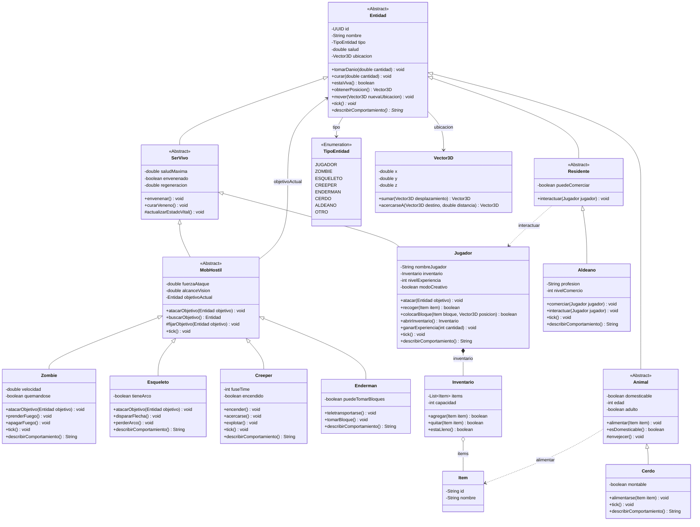

# st-taller-git-2026

-Nombre: Sofia Torres
-Github: Sofia-torres00
-Comision: CYT646 F 

##Levantar la API
./mvnw spring-boot:run 

## Diagrama de clases

```mermaid
classDiagram
    class Entidad {
        <<Abstract>>
        -UUID id
        -String nombre
        -TipoEntidad tipo
        -double salud
        -Vector3D ubicacion
        +tomarDanio(double cantidad) void
        +curar(double cantidad) void
        +estaViva() boolean
        +obtenerPosicion() Vector3D
        +mover(Vector3D nuevaUbicacion) void
        +tick() void*
        +describirComportamiento() String*
    }

    class SerVivo {
        <<Abstract>>
        -double saludMaxima
        -boolean envenenado
        -double regeneracion
        +envenenar() void
        +curarVeneno() void
        #actualizarEstadoVital() void
    }

    class MobHostil {
        <<Abstract>>
        -double fuerzaAtaque
        -double alcanceVision
        -Entidad objetivoActual
        +atacarObjetivo(Entidad objetivo) void
        +buscarObjetivo() Entidad
        #fijarObjetivo(Entidad objetivo) void
        +tick() void
    }

    class Zombie {
        -double velocidad
        -boolean quemandose
        +atacarObjetivo(Entidad objetivo) void
        +prenderFuego() void
        +apagarFuego() void
        +tick() void
        +describirComportamiento() String
    }

    class Esqueleto {
        -boolean tieneArco
        +atacarObjetivo(Entidad objetivo) void
        +dispararFlecha() void
        +perderArco() void
        +describirComportamiento() String
    }

    class Creeper {
        -int fuseTime
        -boolean encendido
        +encender() void
        +acercarse() void
        +explotar() void
        +tick() void
        +describirComportamiento() String
    }

    class Enderman {
        -boolean puedeTomarBloques
        +teletransportarse() void
        +tomarBloque() void
        +describirComportamiento() String
    }

    class Jugador {
        -String nombreJugador
        -Inventario inventario
        -int nivelExperiencia
        -boolean modoCreativo
        +atacar(Entidad objetivo) void
        +recoger(Item item) boolean
        +colocarBloque(Item bloque, Vector3D posicion) boolean
        +abrirInventario() Inventario
        +ganarExperiencia(int cantidad) void
        +tick() void
        +describirComportamiento() String
    }

    class Animal {
        <<Abstract>>
        -boolean domesticable
        -int edad
        -boolean adulto
        +alimentar(Item item) void
        +esDomesticable() boolean
        #envejecer() void
    }

    class Cerdo {
        -boolean montable
        +alimentarse(Item item) void
        +tick() void
        +describirComportamiento() String
    }

    class Residente {
        <<Abstract>>
        -boolean puedeComerciar
        +interactuar(Jugador jugador) void
    }

    class Aldeano {
        -String profesion
        -int nivelComercio
        +comerciar(Jugador jugador) void
        +interactuar(Jugador jugador) void
        +tick() void
        +describirComportamiento() String
    }

    class Inventario {
        -List~Item~ items
        -int capacidad
        +agregar(Item item) boolean
        +quitar(Item item) boolean
        +estaLleno() boolean
    }

    class Item {
        -String id
        -String nombre
    }

    class TipoEntidad {
        <<Enumeration>>
        JUGADOR
        ZOMBIE
        ESQUELETO
        CREEPER
        ENDERMAN
        CERDO
        ALDEANO
        OTRO
    }

    class Vector3D {
        -double x
        -double y
        -double z
        +sumar(Vector3D desplazamiento) Vector3D
        +acercarseA(Vector3D destino, double distancia) Vector3D
    }

    Entidad <|-- SerVivo
    Entidad <|-- Animal
    Entidad <|-- Residente
    SerVivo <|-- MobHostil
    SerVivo <|-- Jugador
    MobHostil <|-- Zombie
    MobHostil <|-- Esqueleto
    MobHostil <|-- Creeper
    MobHostil <|-- Enderman
    Animal <|-- Cerdo
    Residente <|-- Aldeano

    Entidad --> TipoEntidad : tipo
    Entidad --> Vector3D : ubicacion
    MobHostil --> Entidad : objetivoActual
    Jugador *-- Inventario : inventario
    Inventario o-- Item : items
    Animal ..> Item : alimentar
    Residente ..> Jugador : interactuar
```
