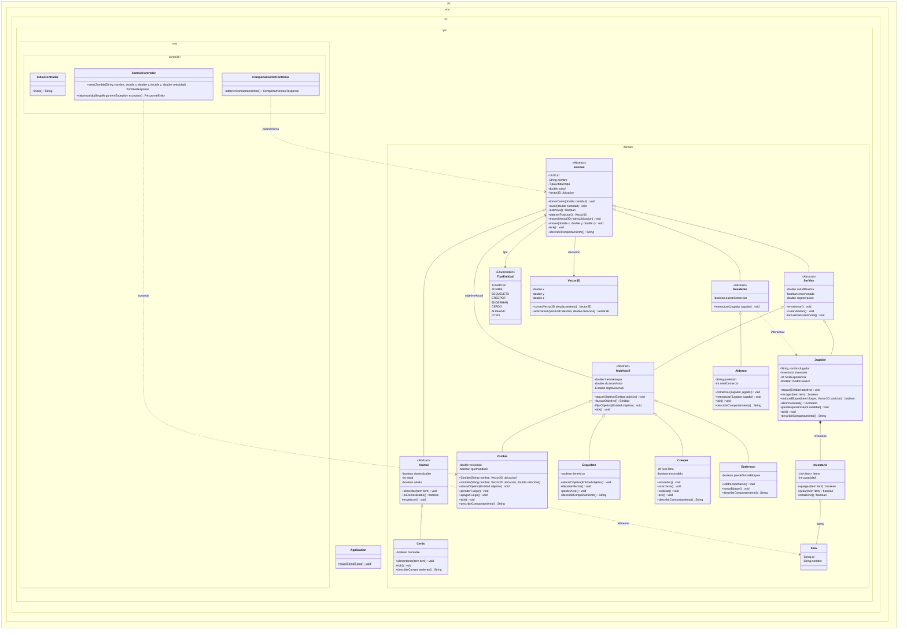

# st-taller-git-2026

-Nombre: Sofia Torres
-Github: Sofia-torres00
-Comision: CYT646 F 

## Levantar la API

Requiere JDK 21. `JAVA_HOME` debe apuntar al JDK 21 y su carpeta `bin` debe estar
en `PATH`. El Wrapper descarga la versión de Maven indicada en
`.mvn/wrapper/maven-wrapper.properties`; no hace falta Maven global.

```sh
java -version
./mvnw -v
./mvnw clean compile
./mvnw spring-boot:run
```

En PowerShell, usar `./mvnw.cmd` en lugar de `./mvnw`. Para seleccionar el JDK
solo en esa terminal (ajustar la ruta a la instalación local):

```powershell
$env:JAVA_HOME = 'C:\Program Files\Eclipse Adoptium\jdk-21.0.12.101-hotspot'
$env:PATH = "$env:JAVA_HOME\bin;$env:PATH"
```

## Diagrama de clases



## POO-06 — 30/09/2026

El dominio está en `src/main/java/py/edu/uc/lp3/domain`
(package `py.edu.uc.lp3.domain`). Los tres controllers están
en `rest/controller` (package `py.edu.uc.lp3.rest.controller`).
`Application` está en `src/main/java/py/edu/uc/lp3/Application.java`, package
`py.edu.uc.lp3`, y solo arranca Spring Boot. Spring detecta los controllers bajo
ese paquete raíz. El diagrama representa Application, los tres controllers y
las 16 clases de dominio, con sus paquetes y relaciones de herencia.

Se agregó la **sobrecarga** `Entidad.mover(double x, double y, double z)`, que
construye un `Vector3D` y delega en `mover(Vector3D nuevaUbicacion)`. Es la misma
acción con distintas listas de argumentos; la validación sigue en el dominio.

`Zombie` también tiene dos constructores: `Zombie(String, Vector3D)` utiliza
velocidad 1.5 y delega en `Zombie(String, Vector3D, double)`, que llama a `super(...)`
y valida la velocidad. Ambas firmas construyen objetos válidos con entradas válidas,
sin setters públicos.

La **sobreescritura** ya existe en `Zombie` y `Creeper`: ambas implementan
`describirComportamiento()` declarado abstracto en `Entidad`, con la misma firma y
comportamientos distintos. `ComportamientoController` las trata como `Entidad`.
La sobrecarga cambia los argumentos; la sobreescritura cambia la implementación
heredada, seleccionada según el tipo real del objeto.

### Ejemplos REST

- `GET /`: presentación de la API.
- `GET /api/zombie?nombre=Zombie1&x=0&y=64&z=0&velocidad=1.5`: construye un zombie con parámetros de URL.
- `GET /api/comportamientos`: JSON con el comportamiento de un zombie y un creeper.

Las reglas de nombre, coordenadas y velocidad se validan en `Entidad`, `Vector3D`
y `Zombie`, respectivamente. `ZombieController` convierte las
`IllegalArgumentException` del dominio en HTTP 400 con JSON `{"error":"mensaje"}`,
sin duplicar esas reglas. Una velocidad negativa devuelve 400; una válida, 200.
